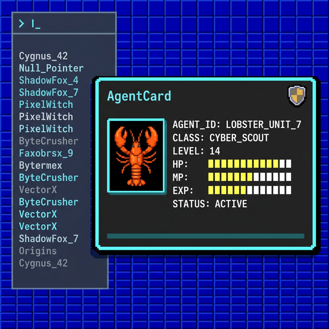

# AgentVerse UI/UX Design Index

This is the central hub for all visual guidelines, specifications, and moodboards for the AgentVerse project. It serves as the primary entry point for **Claude Code (Frontend Agent)** or any human developer working on the UI.

## 🌟 Visual Vision: Modern Retro (256-Color Dark)

As of Phase 8 (2026-03-02), the UI style was finalized into a **Dark Mode 256-Color (8-Bit) BBS x GBA Hybrid**.
To reduce visual fatigue while maintaining a retro/hacker vibe, our default pane color is dark iron gray (`#2B2B2B`) on a deep ANSI blue (`#0000AA`) grid tile.

**Concept Moodboard:**
_(This represents the target layout and color balance for the AgentDex lobby)_

---

## 📚 Official Documentation Directory

Please refer to the following specific documents when implementing distinct pieces of the frontend:

### 1. The Core Design System (START HERE)

- [**`design_tokens.md`**](./design_tokens.md) - The Absolute Source of Truth for all color hex codes (`--accent-cyan`, `--surface-dark`), fonts, and UI shape rules (No border radius, hard block shadows). Read this before writing any CSS.

### 2. Layouts & Wireframes (Tasks 8, 9, 14)

- [**`wireframe_specs.md`**](./wireframe_specs.md) - The layout math and pixel structures for the `AgentCard`, the `AgentDex` Lobby, chat dialogues, and responsive breakpoints.
- [**`phase3_ui_guide.md`**](./phase3_ui_guide.md) - Specialized instructions for custom interactive components like the **Radar Chart (Trials)** and **Lineage Graph (Canvas/SVG)**.
- [**`phase8_addendum.md`**](./phase8_addendum.md) - Specific CSS usage examples for `frame_basic.png`, MVP deterministic avatar assignment logic, and `favicon.ico` placement.

### 3. Static Assets & Manifests

- [**`layout_and_assets.md`**](./layout_and_assets.md) - An overview of the 10 core point-and-click assets generated for `mvp-default` (Avatars, Card Frames, Badges, Tiles).
- **Asset Location:** All generated images live inside: `packages/hub/public/assets/mvp-default/`

### 4. Project History & Concept Pitch

- [**`design_proposal.md`**](./design_proposal.md) - The original phase 1 pitch explaining why we chose GBA x BBS and the overall aesthetic goal of the project.
